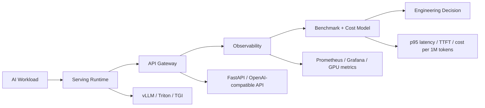

  
  
  

---

## Engineering Profile

I am building toward AI Infrastructure Engineering: LLM serving platforms, inference benchmarking, GPU-aware observability, and cost/performance systems for production AI. My recent work focuses on making model serving measurable, reliable, and economically understandable.

> Current direction: LLM systems, inference optimization, GPU telemetry, platform APIs, and applied AI workflows that can be explained, tested, and operated.

## Technical Focus

**AI systems:** LLM inference, benchmark harnesses, prompt/runtime evaluation, quantization awareness, model-serving APIs.  
**AI infrastructure:** Python, FastAPI, Pydantic, async services, API gateways, testing, structured logging.  
**Systems platform:** Docker, Kubernetes, KEDA, Prometheus, Grafana, GPU scheduling concepts, CI workflows.  
**Data and optimization:** NumPy, Pandas, SciPy, scikit-learn, Qiskit, MLflow, experiment tracking.  
**Frontend for systems tools:** TypeScript, React, Next.js, dashboards, operational UI, data visualization.

## Featured Systems

  
  
  
  

### Triton + TensorRT-LLM Benchmark Suite

A reproducible benchmark harness for comparing LLM serving runtimes across latency, throughput, and cost.

- **Problem:** tokens/sec alone hides tail latency, batching behavior, and infrastructure cost.
- **Architecture:** config-driven Python runner, runtime adapters, metrics aggregation, Prometheus export, Docker/Kubernetes templates, and GPU pricing models.
- **Technical interest:** p50/p95/p99 latency, TTFT, inter-token latency, closed-loop concurrency, quantization paths, and cost per million tokens.

### Aegis LLM Inference Platform

A production-style Kubernetes platform for serving LLMs through an OpenAI-compatible API backed by vLLM workers on GPU nodes.

- **Problem:** LLM inference is latency-sensitive, GPU-constrained, and difficult to operate without request-level and GPU-level visibility.
- **Architecture:** FastAPI gateway, mock/vLLM inference runtimes, GPU-aware Kubernetes manifests, HPA/KEDA autoscaling, Prometheus metrics, Grafana dashboards, and a Next.js ops dashboard.
- **Technical interest:** queue-depth autoscaling, streaming completions, gateway/inference separation, SLO-oriented dashboards, and honest implementation status.

<strong>More selected work</strong>

### Quantum-Enhanced Portfolio Optimizer

An experimental portfolio optimization platform combining quantum algorithms with classical optimization baselines and a modern web interface.

- **Problem:** portfolio optimization needs explainable comparison between classical baselines and experimental quantum approaches.
- **Architecture:** Python optimization engine, QAOA experiments, classical mean-variance baselines, MLflow tracking, and a Next.js job interface.
- **Technical interest:** algorithmic experimentation paired with tracking, backtesting, and UI workflows instead of a notebook-only prototype.

### AI-Powered Grievance Management System

A multilingual grievance workflow system for submitting, classifying, tracking, and managing public complaints.

- **Problem:** grievance systems need structured workflows, document intake, language support, and status visibility.
- **Architecture:** Next.js application with Supabase-backed authentication, real-time updates, role-based access, OCR-assisted file processing, and admin workflow screens.
- **Technical interest:** combines AI-assisted classification, multilingual document handling, real-time state changes, and database access control.

## Systems Thinking

I like systems where engineering decisions can be traced back to measurements: latency, error rate, throughput, resource utilization, and cost.

## GitHub Signals

  
  

  

<strong>GitHub achievement snapshot</strong>

  

## Engineering Principles

- Measure before optimizing. Good systems expose latency, error, throughput, and cost signals.
- Make architecture inspectable. A README, diagram, test, or dashboard should reduce ambiguity for the next engineer.
- Prefer honest status over inflated claims. Mark what is implemented, scaffolded, experimental, or roadmap.
- Build with operational failure in mind: timeouts, retries, rate limits, metrics, logs, and clear runbooks.

## Contact

I am interested in AI infrastructure, LLM systems, applied ML products, and engineering teams that care about measurable, maintainable systems.

  
  

