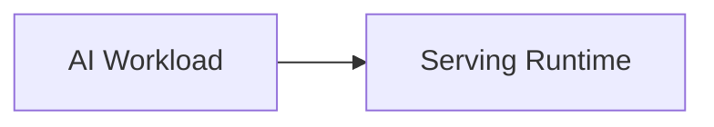

# Visual GitHub Profile README Redesign Report

Prepared for: Udhaya Kumar A (`ukexe`)

## Research Summary

I researched modern GitHub profile README patterns across GitHub Docs, open-source widget documentation, curated "awesome profile" repositories, developer design guides, hiring-focused articles, and community discussions. The strongest consensus is that visual README design works best when it behaves like a landing page: clear positioning first, then proof of work, then optional dynamic signals.

The modern toolbox is large:

- Animated hero banners with Capsule Render.
- Typing SVG intros with Readme Typing SVG.
- Dynamic GitHub stats with GitHub Readme Stats.
- Streak cards with GitHub Readme Streak Stats.
- Activity graphs with GitHub Readme Activity Graph.
- Achievement trophies with GitHub Profile Trophy.
- Skill icon rows with Skill Icons or Shields.io.
- Repository cards with GitHub Readme Stats pin cards.
- Contribution snake or Pacman animations generated by GitHub Actions.
- GitHub Metrics by lowlighter for advanced generated infographics.
- WakaTime coding-time summaries.
- Blog/RSS feed sections generated by GitHub Actions.
- Spotify now-playing widgets.
- LeetCode, Codeforces, CodeChef, HackerRank, TryHackMe, and Holopin badges.
- Dark/light adaptive images using `picture` and `prefers-color-scheme`.
- Mermaid diagrams rendered natively by GitHub.
- Expandable sections with `<details>`.
- Centered layouts using HTML `align="center"`.
- Custom SVG assets hosted in the profile repo or via external SVG renderers.
- Profile banners, social badges, repository cards, and visual project showcases.

The hiring-specific sources are more cautious. They repeatedly say recruiters and hiring managers value fast comprehension, polished pinned repos, clear project READMEs, and evidence of shipped or well-structured work. They often ignore or dislike visual clutter: visitor counters, too many stats widgets, quote widgets, excessive animation, contribution snakes, massive badge walls, Spotify widgets, and gamified badges that do not relate to the role.

The redesigned README therefore uses high-impact visual elements that reinforce the AI infrastructure and LLM systems story, while excluding elements that would make the profile look gimmicky or generic.

## Chosen Visual Techniques

### Capsule Render Hero

Included because it creates immediate visual identity and makes the README feel like a landing page. The chosen colors are dark blue, cyan, and teal to match an AI infrastructure and LLM systems aesthetic without rainbow clutter.

Setup:

```md

```

### Readme Typing SVG

Included because a single animated line adds motion and memorability near the hero. It is limited to three substantive engineering lines, not generic slogans.

Setup:

```md

```

### Shields.io CTA Badges

Included for quick professional navigation: GitHub, LinkedIn, and Explore Repositories. The badges are intentionally limited to three, using consistent colors and `for-the-badge` style.

Setup:

```md
https://img.shields.io/badge/GitHub-ukexe-0f172a?style=for-the-badge&logo=github&logoColor=white
```

### Skill Icons

Included to replace the old massive badge wall with a compact, curated stack. This keeps visual impact while communicating specialization.

Setup:

```md
[](https://skillicons.dev)
```

### GitHub Readme Stats Repository Cards

Included because project click-through matters more than generic profile widgets. Repository cards visually invite visitors to open the strongest work.

Setup:

```md
https://github-readme-stats.vercel.app/api/pin/?username=ukexe&repo=trt-llm-triton-benchmark-suite&theme=transparent&hide_border=true
```

### Mermaid Architecture Diagram

Included because it turns the README from a visual portfolio into a technical artifact. It communicates systems thinking, observability, and measurement.

Setup:

````md

````

GitHub renders Mermaid diagrams natively in Markdown files.

### GitHub Stats And Streak Cards

Included to add dynamic visual proof of public activity, but limited to two cards. They are not used as the main proof of ability; the projects remain the main signal.

Setup:

```md
https://github-readme-stats.vercel.app/api?username=ukexe&show_icons=true&theme=transparent&hide_border=true
https://streak-stats.demolab.com?user=ukexe&theme=transparent&hide_border=true
```

### GitHub Activity Graph

Included because it provides a visually strong full-width section and shows recent profile activity without requiring a GitHub Action.

Setup:

```md
https://github-readme-activity-graph.vercel.app/graph?username=ukexe&theme=react-dark&hide_border=true
```

### GitHub Profile Trophy

Included only inside a collapsed `<details>` section. It adds polish for visitors who want more dynamic GitHub signals without overwhelming the main profile.

Setup:

```md
https://github-profile-trophy.vercel.app/?username=ukexe&theme=algolia&row=1&column=6&no-frame=true&no-bg=true&margin-w=12
```

### Expandable Details Sections

Included to keep the primary profile concise while still offering additional project details and trophy widgets.

Setup:

```html
<details>
<summary><strong>More selected work</strong></summary>

Content here.

</details>
```

### HTML Alignment

Included because GitHub Markdown does not provide native centering. GitHub supports a subset of HTML and commonly allows `align="center"` for profile README layouts.

Setup:

```html
<div align="center">
  
</div>
```

## Excluded Popular Elements

### Contribution Snake

Excluded from the main README because it is visually fun but widely recognized as a profile decoration. It does not improve the AI infrastructure and LLM systems hiring narrative. It also requires a GitHub Actions workflow and generated assets; including it before setup would create broken images.

Optional setup if desired later:

```yaml
name: Generate snake
on:
  schedule:
    - cron: "0 0 * * *"
  workflow_dispatch:
jobs:
  generate:
    runs-on: ubuntu-latest
    permissions:
      contents: write
    steps:
      - uses: Platane/snk/svg-only@v3
        with:
          github_user_name: ukexe
          outputs: dist/github-snake.svg
      - uses: crazy-max/ghaction-github-pages@v4
        with:
          target_branch: output
          build_dir: dist
        env:
          GITHUB_TOKEN: ${{ secrets.GITHUB_TOKEN }}
```

### Visitor Counter

Excluded because it is low-signal and can make the profile look template-generated. Hiring sources consistently prioritize project quality over view counts.

### Spotify Integration

Excluded because it adds personality but not professional signal for AI infrastructure roles. It also requires third-party setup and can distract from repositories.

### WakaTime Integration

Excluded for now because it only becomes valuable if your WakaTime data is accurate and representative. It can be added later with GitHub Metrics or WakaTime Readme Stats if you consistently track coding time.

### LeetCode, Codeforces, CodeChef, HackerRank

Excluded because the target brand is AI infrastructure and LLM systems engineering, not competitive programming. Add one only if you are actively applying to roles where coding-platform ranking is a strong signal.

### Holopin Badges

Excluded because they are gamified and not directly related to the target specialization.

### Dev Quote Widgets

Excluded because they are generic, external, and reduce the premium feel. The old README already used a quote widget; removing it improves credibility.

### Lottie

Excluded because GitHub READMEs do not execute arbitrary JavaScript, so Lottie animations are not directly supported in the way they are on web pages. They would need conversion to GIF or SVG, which usually adds weight without improving signal.

### 3D Contributions And GitHub Skyline

Excluded from the main README because they are impressive but novelty-focused. They work better as linked experiments than as the main profile surface.

### Massive Badge Wall

Excluded because it was the main weakness of the original profile. A small curated icon row communicates specialization better than dozens of loosely related tools.

### Multiple Top-Language Cards

Excluded because top-language cards often overrepresent HTML, notebooks, generated code, or repo count rather than ability. Project cards and technical descriptions are more useful.

## External Services Used

- Capsule Render: animated header and footer SVGs.
- Readme Typing SVG: animated professional headline.
- Shields.io: social and CTA badges.
- Skill Icons: compact technology icon row.
- GitHub Readme Stats: profile stats and repository cards.
- GitHub Readme Streak Stats: contribution streak card.
- GitHub Readme Activity Graph: contribution activity graph.
- GitHub Profile Trophy: collapsed achievement snapshot.
- GitHub Mermaid renderer: architecture diagram.

No API keys, secrets, workflows, npm packages, local build tools, or custom hosting are required for the current README.

## Maintenance Notes

- Public widget endpoints can rate-limit or go down. For maximum reliability, self-host GitHub Readme Stats or replace dynamic images with local SVG assets.
- If a widget breaks, the README still has text descriptions and direct project links.
- Keep the featured repositories aligned with pinned repositories on the GitHub profile.
- Add real descriptions and topics to the top repositories so repository cards render meaningful context.
- If you later add generated assets such as a snake animation, do it through GitHub Actions and do not commit secrets.

## Citations

Official GitHub documentation:

- GitHub Docs, "Managing your profile README" - https://docs.github.com/en/account-and-profile/how-tos/profile-customization/managing-your-profile-readme
- GitHub Docs, "About the repository README file" - https://docs.github.com/en/repositories/managing-your-repositorys-settings-and-features/customizing-your-repository/about-readmes
- GitHub Docs, "Creating diagrams" - https://docs.github.com/en/get-started/writing-on-github/working-with-advanced-formatting/creating-diagrams
- GitHub Blog, "5 tips for making your GitHub profile page accessible" - https://github.blog/developer-skills/github/5-tips-for-making-your-github-profile-page-accessible/

Widget and open-source documentation:

- Capsule Render - https://github.com/kyechan99/capsule-render
- Capsule Render widget reference - https://xiaohuohumax.github.io/readme-widget-hub/en-US/widgets/common/capsule-render
- Readme Typing SVG FAQ - https://github.com/DenverCoder1/readme-typing-svg/blob/main/docs/faq.md
- GitHub Readme Stats - https://github.com/anuraghazra/github-readme-stats
- GitHub Readme Stats repository card docs - https://github.com/anuraghazra/github-readme-stats#github-extra-pins
- GitHub Profile Trophy - https://github.com/ryo-ma/github-profile-trophy
- GitHub Profile Trophy widget reference - https://xiaohuohumax.github.io/readme-widget-hub/en-US/widgets/github/github-profile-trophy
- Skill Icons - https://github.com/tandpfun/skill-icons
- Skill Icons widget reference - https://xiaohuohumax.github.io/readme-widget-hub/en-US/widgets/common/skill-icons
- GitHub Metrics - https://github.com/lowlighter/metrics
- Platane Snake - https://github.com/Platane/snk

Curated profile/tool guides:

- Charmve, "awesome-github-profile" - https://github.com/Charmve/awesome-github-profile
- flyingsquirrel0419, "awesome-git-profile" - https://github.com/flyingsquirrel0419/awesome-git-profile
- rohitdeshmukh27, "github-profile-readme-guide" - https://github.com/rohitdeshmukh27/github-profile-readme-guide
- dhyeythumar, "awesome-readme-tools" - https://github.com/dhyeythumar/awesome-readme-tools
- rahuldkjain, "github-profile-readme-generator" - https://github.com/rahuldkjain/github-profile-readme-generator
- DEV Community, "Your GitHub Profile README Is Boring. Here's How to Fix It with SVG and GitHub Actions." - https://dev.to/flyingsquirrel0419/your-github-profile-readme-is-boring-heres-how-to-fix-it-with-svg-and-github-actions-3pim
- DEV Community, "Top GitHub Profile Tools and Stats Generators (2026)" - https://dev.to/_d7eb1c1703182e3ce1782/top-github-profile-tools-and-stats-generators-2026-2h3h
- DEV Community, "Level Up Your GitHub Profile With These 20+ Amazing Resources!" - https://dev.to/jfmartinz/level-up-your-github-profile-with-these-20-amazing-resources-524p

Hiring and profile-quality guidance:

- Quillly / DevBio, "GitHub Profile README: What to Include in 2026" - https://devbio.me/blogs/github-profile-readme-guide
- Codeboards.io, "GitHub Profile README: The Complete Guide to Standing Out in 2026" - https://codeboards.io/blog/github-profile-readme-guide
- LastRound AI, "GitHub Profile Tips for Getting Hired" - https://lastroundai.com/blog/github-profile-tips
- IT Support Group, "Is Your GitHub Costing You IT Job Offers?" - https://thisisanitsupportgroup.com/blog/github-profile-it-careers-portfolio-guide-2026/
- TechInterview, "GitHub Profile Polish for Engineers: Pinned Repos, READMEs, What Recruiters Click On" - https://www.techinterview.org/post/3233474626/github-profile-engineers/

Markdown and layout references:

- Stack Overflow, "How do I center an image in the README.md file on GitHub?" - https://stackoverflow.com/questions/12090472/how-do-i-center-an-image-in-the-readme-md-file-on-github
- Frank Wiles, "Light and dark mode SVGs for Github READMEs" - https://frankwiles.com/til/light-dark-github-readme/
- BuiltFast, "Dark mode images in GitHub READMEs" - https://builtfast.dev/blog/dark-mode-images-in-github-readmes/
- RichLewis007, "HTML Tags Supported in GitHub Flavored Markdown Documents" - https://github.com/RichLewis007/HTML-Tags-Supported-in-GitHub-Flavored-Markdown-Documents
